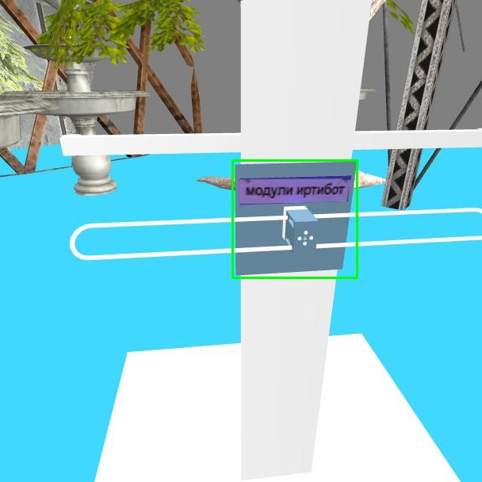
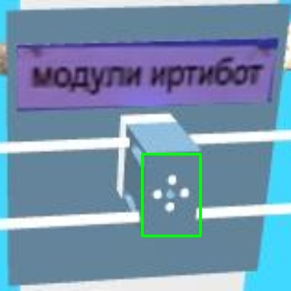
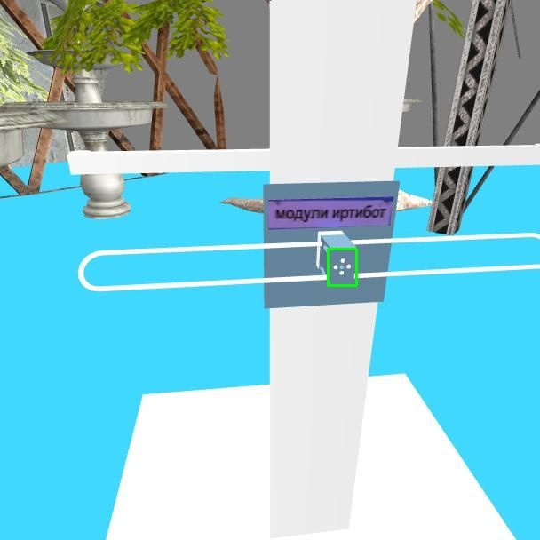

# iarc_ml

## Updates

- Added *detect.py*. This is an example of a ROS node subscribing to the camera topic and running the model on it.
- Trained module on new mast\
Update the cfg file to *yolov4_module_new.cfg* and the weights file too to run the new model.
- Trained module with yolov4 tiny which runs at 64fps on colab (as opposed to 20fps for yolov4).\
Update the cfg file to *yolov4-tiny_module.cfg* and the weights file too to run the tiny model.\
Note : There was a bug in *darknet2pytorch.py*. So clone again to run tiny model. 
- Added package *full_mast* which has mast with the text. Copy *full_mast* directory to *.gazebo/models* 
- Defined a function *find_nav_lights* in *light.py* \
`[red_state,red_centre,green_state,green_centre]=find_nav_lights(cv_img)` \
*state* is a string which takes values "On", "Off" or "Not Found" \
*centre* is tuple of integers (x,y)\   

## Weights

Download the weights from these drive links and keep it in the *backup* folder.

- [board](https://drive.google.com/file/d/1W63HaBdtmTq_cT1u0SDh5tvrRmQTD4zI/view?usp=sharing)
- [module](https://drive.google.com/file/d/1-aGdPU61z8n1VrkYkSnyJPlVrKuZUq4A/view?usp=sharing)
- [module_new](https://drive.google.com/file/d/1Mbv-Mt756YZ_OKRp_Sf20Q3lilPeooei/view?usp=sharing)
- [tiny_module](https://drive.google.com/file/d/1VfXnKt03awvFPVqv9OVbZf6G2q3r_pEB/view?usp=sharing)

## Usage 

A class *Darknet* is defined and both the pytorch models are instances of this class.

`model=Darknet('cfg/cfg_file.cfg',inference=True)`\
`model.load_weights('backup/weights_file.weights')`\
`model.cuda()`

Two functions *my_detect* and *end_to_end* are defined in *iarc.py*.

`ret,x1,y1,x2,y2=my_detect(model,cv_img)`

Expects the cv_img in BGR format with entries in [0,255] and the pytorch model.\
Returns a list of boolean flag (true if bbox predicted) and four integers (x1,y1) is the coordinate of top left corner and (x2,y2) is the coordinate of the bottom right corner. Returns 0's if no box is detected. (Note : x axis is the width of image)

`ret,x1,y1,x2,y2=end_to_end(board,module,cv_img)`

Expects the cv_img in BGR format with entries in [0,255] and both pytorch models.\
Directly returns coorinates of bounding box of module from raw image. Format is similar as above.

## Pictures

- `ret,x1,y1,x2,y2=my_detect(board,cv_img)`

- `ret,x1,y1,x2,y2=my_detect(module,cv_img)`

- `ret,x1,y1,x2,y2=end_to_end(board,module,cv_img)`

## References 

- darknet-[https://github.com/AlexeyAB/darknet](https://github.com/AlexeyAB/darknet)
- pytorch-[https://github.com/Tianxiaomo/pytorch-YOLOv4](https://github.com/Tianxiaomo/pytorch-YOLOv4)